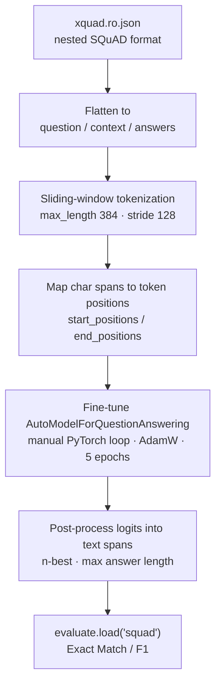

# Romanian Extractive QA on XQuAD-ro

Fine-tuning two BERT-family encoders for **extractive question answering in Romanian**, then comparing them under an identical training recipe.

The question this project actually asks: **for a lower-resource language, is a monolingual model trained on that language better than a multilingual model that has seen it among 103 others?**

The intuition says the monolingual model wins. Under this setup, it didn't.

---

## Problem

Extractive QA means the answer is always a **contiguous span of the context**, not generated text. Given a question and a paragraph, the model predicts two integers: where the answer starts and where it ends. That framing is why the head is `AutoModelForQuestionAnswering` — two linear classifiers over token positions, one for start, one for end — and why the metrics are Exact Match and F1 over spans rather than perplexity or accuracy.

## Data

[XQuAD](https://github.com/google-deepmind/xquad) is SQuAD v1.1's development set professionally translated into 11 languages. This project uses the Romanian split, `xquad.ro.json`, loaded straight from the DeepMind repository.

| | |
|---|---|
| Examples | ~1,190 question/context pairs |
| Structure | SQuAD-style: `data → paragraphs → qas → answers` |
| Domain | Wikipedia (heavily NFL/Super Bowl, inherited from the SQuAD dev split) |
| Answer format | `{text, answer_start}` — a character offset into the context |

The nested JSON is flattened into the flat `{question, context, answers}` schema that the tokenizer and the metric expect.

## Preprocessing: why sliding windows are mandatory

This is the part of extractive QA that catches people out.

BERT accepts 512 tokens; this pipeline uses 384. Wikipedia paragraphs routinely exceed that. Truncating normally would silently **delete the answer** from a fraction of training examples, and the model would then be trained to predict a span that isn't there.

The fix is to let one example become several:

```python
tokenizer(
    questions, contexts,
    max_length=384,
    truncation="only_second",        # never truncate the question
    stride=128,                      # overlap between consecutive windows
    return_overflowing_tokens=True,  # emit multiple features per example
    return_offsets_mapping=True,     # char <-> token alignment
)
```

Three details make it work:

- **`truncation="only_second"`** — the question is always kept whole; only the context is cut.
- **`stride`** — consecutive windows overlap, so an answer straddling a boundary still appears complete in at least one window.
- **`return_offsets_mapping`** — the dataset gives answers as *character* offsets, but the model predicts *token* indices. The offset mapping converts between them, and it is also what turns predicted tokens back into readable text at inference.

Each window is then labelled: if the answer lies inside it, `start_positions` / `end_positions` point at the right tokens; if it doesn't, both point at the `[CLS]` token — the conventional "no answer in this window" target.

## Pipeline



Post-processing is not a formality. The raw output is two logit vectors per window. Turning those into an answer means taking the top-n start and end candidates, discarding pairs where the end precedes the start or the span is implausibly long, mapping the surviving pair back through the offset mapping, and — because one example may have produced several windows — picking the best answer *across* all windows belonging to that example.

## Training setup

Both notebooks use an **identical recipe**, which is what makes the comparison meaningful:

| | |
|---|---|
| Training loop | Hand-written PyTorch (not `Trainer`) |
| Optimizer | `AdamW`, lr = 5e-5 |
| Schedule | Linear decay via `get_scheduler` |
| Epochs | 5 |
| Batch size | 8 |
| Max sequence length | 384, stride 128 |
| Hardware | Single T4 (Colab) |

Writing the loop by hand rather than using `Trainer` was deliberate — the goal was to see the optimizer stepping, scheduler and evaluation loop explicitly, having already used `Trainer` in the chapter 3 notebooks.

## Results

| Model | Exact Match | F1 |
|---|---:|---:|
| [`dumitrescustefan/bert-base-romanian-cased-v1`](https://huggingface.co/dumitrescustefan/bert-base-romanian-cased-v1) — monolingual | 32.34 | 45.50 |
| [`bert-base-multilingual-cased`](https://huggingface.co/bert-base-multilingual-cased) — multilingual | **36.60** | **48.46** |

**Multilingual BERT came out ahead on both metrics** — roughly +4 EM and +3 F1 over the Romanian-specific model.

That is the opposite of the naive expectation, and it is worth being careful about rather than declaring a winner. Plausible explanations, none of them tested here:

- **mBERT saw far more pretraining data overall**, and QA transfers strongly across languages — the task structure may matter more than the language.
- **XQuAD is translated SQuAD**, so the contexts are translationese about American football rather than natively authored Romanian text. That may suit a multilingual model better than one pretrained on native Romanian corpora.
- **The training set is tiny**, so both models sit closer to their pretrained priors than to a converged fine-tune, and the gap may be within run-to-run noise. Neither notebook sets a seed.

## Limitations

Read the numbers above as *"this pipeline runs end to end and produces plausible spans"*, not as a benchmark result. Specifically:

- **Train and evaluation use the same file.** XQuAD-ro is an evaluation set of ~1.2k examples with no training split. Both notebooks fine-tune and score on it, so these figures measure fit, not generalization. They are **not** comparable to published XQuAD numbers.
- **No held-out set, no cross-validation, no seed control.** One unseeded run per model.
- **No hyperparameter search.** Both models got the recipe that seemed reasonable, not the recipe that suits each best — which could plausibly account for the gap on its own.
- **~1.2k examples is very small** for fine-tuning a 110M-parameter encoder.

## What would make this rigorous

1. **Fine-tune on a genuinely larger Romanian QA corpus** — machine-translated SQuAD, or a native Romanian dataset — and keep XQuAD-ro entirely held out. That single change converts these numbers from "fit" into "generalization".
2. **Multiple seeds**, reporting mean and spread, so a 4-point gap can be distinguished from noise.
3. **A per-question-type breakdown** — the monolingual model may win on some categories while losing overall.
4. **Publish both checkpoints to the Hub** with model cards stating the training data and the caveats above.

## Notebooks

| Notebook | Base model | Colab |
|---|---|---|
| [`bert-base-romanian-cased-v1.ipynb`](bert-base-romanian-cased-v1.ipynb) | Monolingual Romanian BERT | [](https://colab.research.google.com/github/pop123-ux/HuggingFace-Project-Learning/blob/main/projects/romanian-qa-xquad-ro/bert-base-romanian-cased-v1.ipynb) |
| [`multilingual-bert.ipynb`](multilingual-bert.ipynb) | Multilingual BERT baseline | [](https://colab.research.google.com/github/pop123-ux/HuggingFace-Project-Learning/blob/main/projects/romanian-qa-xquad-ro/multilingual-bert.ipynb) |

## Running

```bash
pip install -r ../../requirements.txt
jupyter lab
```

Or open either Colab badge above. A single T4 is enough; each notebook trains in well under an hour.
